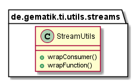
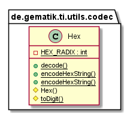
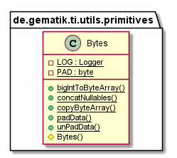

# Ti-Utils

This part describes the Ti-Utils functionalities and structure.

## API Documentation

Generated API docs are available at <https://gematik.github.io/ref-Ti-Utils>.

## License

Licensed under the [Apache License, Version 2.0](https://www.apache.org/licenses/LICENSE-2.0).

## Structure

### StreamUtils

The StreamUtils functions capture exception thrown by execution on streams.
With special funktions will wrap the call on orginal object and all exception wrapped as `StreamRuntimeException`.

  

The usage is described in [GettingStarted Ti-Utils](#tiutils_streamutils)

### Codec

This package contains a Hex class with converter functionality for hex strings.
The Hex class is inspired from org.apache.commons.codec.binary.Hex (Licence: <http://www.apache.org/licenses/>).
Detailed information will found in javadoc of this project.

  

### Primitives

This package contains a Bytes class with utils functionality for byte arrays.
The Hex class is inspired from com.google.common.primitives.Bytes (Apache License 2.0) <http://www.apache.org/licenses/LICENSE-2.0.html>
See the Guava User Guide article on primitive utilities.

Detailed information will found in javadoc of this project.

  

## Getting Started

### Build setup

To use Ti-Utils library in a project, you need just to include following dependency:

**Gradle dependency settings to use Ti-Utils library.**

    dependencies {
        implementation group: 'de.gematik.ti', name: 'utils', version: '1.2.1'
    }

**Maven dependency settings to use Ti-Utils library.**

    <dependencies>
        <dependency>
            <groupId>de.gematik.ti</groupId>
            <artifactId>utils</artifactId>
            <version>1.2.1</version>
        </dependency>
    </dependencies>

### StreamUtils

The StreamUtils methods are available as static call with `de.gematik.ti.utils.streams.stat.StreamUtils` and as instance call from `de.gematik.ti.utils.streams.StreamUtils`.

#### WrapConsumer call

**WrapConsumer call with StreamUtils.**

    private List<ExceptionClass> list;
    list = Arrays.asList(new ExceptionClass(), new ExceptionClass(), new ExceptionClass());

    list.stream().forEach(new StreamUtils().wrapConsumer(v -> v.testMethod()));

This is also available as a static method call with `StreamUtils` from package `de.gematik.ti.utils.streams.stat`

**WrapConsumer call with static StreamUtils.**

    private List<ExceptionClass> list;
    list = Arrays.asList(new ExceptionClass(), new ExceptionClass(), new ExceptionClass());

    list.stream().forEach(StreamUtils.wrapConsumer(v -> v.testMethod()));

#### WrapFunction call

**WrapFunction call with StreamUtils.**

    private List<ExceptionClass> list;
    list = Arrays.asList(new ExceptionClass(), new ExceptionClass(), new ExceptionClass());

    list.stream().map(new StreamUtils().wrapFunction(v -> v.getValue())).collect(Collectors.toList());

This is also available as a static method call with `StreamUtils` from package `de.gematik.ti.utils.streams.stat`

**WrapFunction call with static StreamUtils.**

    private List<ExceptionClass> list;
    list = Arrays.asList(new ExceptionClass(), new ExceptionClass(), new ExceptionClass());

    list.stream().map(StreamUtils.wrapFunction(v -> v.getValue())).collect(Collectors.toList());
